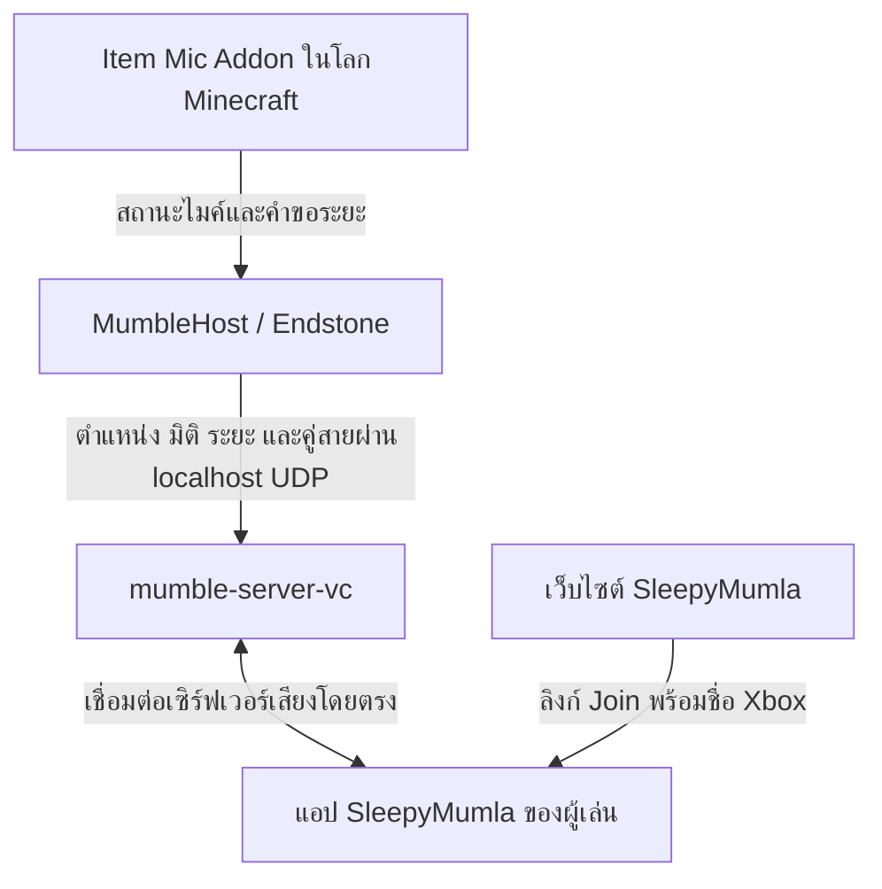

# SleepyMumla — Minecraft Bedrock VoiceChat

SleepyMumla คือระบบแชตเสียงสำหรับ **Minecraft Bedrock บนเซิร์ฟเวอร์ Endstone ของ MCSV** ผู้เล่นเปิดแอปเสียงบน Android ควบคู่กับ Minecraft ส่วนเซิร์ฟเวอร์เป็นผู้กำหนดว่าใครได้ยินใคร ตามตำแหน่ง ระยะไมค์ และมิติในเกม

- [เว็บไซต์ SleepyMumla](https://sleepyvoice-join.vercel.app/) — ดาวน์โหลดแอป สร้างลิงก์ Join และติดตั้งระบบไมค์
- [Releases](https://github.com/samsosleepy2007/VoiceChat-Mumble-MCSV/releases) — APK, ปลั๊กอิน Endstone, แอดออน และไฟล์ตรวจ SHA-256
- [ซอร์สของแอปและเว็บไซต์รุ่นปัจจุบัน](https://github.com/samsosleepy2007/VoiceChat-Mumble-MCSV/tree/main) — สาขา `main`

## ระบบประกอบด้วยอะไรบ้าง

| ส่วนประกอบ | หน้าที่ | เทคโนโลยีที่ใช้ |
| --- | --- | --- |
| Item Mic Addon | ไอเทมไมค์ เมนูปรับระยะ เปิด/ปิดเสียง และ SleepyPhone | Minecraft Behavior Pack / Resource Pack, JavaScript และ Script API |
| MumbleHost | อ่านสถานะผู้เล่นและควบคุม Mumble Server ภายในเซิร์ฟเวอร์ Minecraft | Python และ Endstone |
| `mumble-server-vc` | รับส่งเสียงและเลือกผู้ฟังตามระยะ มิติ และคู่สายโทรศัพท์ | Mumble Server 1.6.870 พร้อมแพตช์ C++ ของโครงการ |
| SleepyMumla Android | รับเสียงจากไมค์ เล่นเสียงของผู้เล่นอื่น และรับลิงก์ Join จากเว็บ | Java, Mumla/Humla, Opus และ Android audio APIs |
| เว็บไซต์ | ดาวน์โหลดแอป สร้างลิงก์ เข้าสู่ระบบด้วย Discord และติดตั้งผ่าน MCSV API | HTML, CSS, JavaScript, Node.js 22 และ Vercel Functions |

### ชุดไฟล์ที่เผยแพร่ปัจจุบัน

| ส่วนประกอบ | เวอร์ชัน | ไฟล์ |
| --- | --- | --- |
| แอป Android | 0.6.9 | `SleepyMumla-v0.6.9.apk` |
| ปลั๊กอิน Endstone | 0.5.5 | `endstone_mumble_host-0.5.5-py3-none-any.whl` |
| Item Mic Addon | 2.15.39 | `VC_Mumble_ItemMic_v2.15.39_MicFix.mcaddon` |

แต่ละส่วนมีหมายเลขเวอร์ชันแยกกัน เช่น Release ของแอป 0.6.9 ยังใช้ปลั๊กอิน 0.5.5 และแอดออน 2.15.39 ได้ โดยแนบทั้งสามส่วนพร้อมไฟล์ SHA-256 ใน Release เดียวกัน

## เสียงและข้อมูลเกมเชื่อมกันอย่างไร



1. ผู้เล่นใช้ Item Mic เพื่อควบคุมเสียงและระยะที่ต้องการ แอดออนส่งสถานะผ่าน tags และระบบ request/ACK ใน Minecraft
2. ปลั๊กอิน Endstone อ่านชื่อผู้เล่น ตำแหน่ง มิติ และสถานะไมค์ แล้วส่งข้อมูลให้ Mumble Server ที่ทำงานอยู่ในเซิร์ฟเวอร์เดียวกัน
3. ผู้เล่นเชื่อมต่อแอปด้วย **ชื่อ Xbox ที่ตรงกับชื่อใน Minecraft รวมถึงตัวพิมพ์ใหญ่–เล็ก** เพื่อให้ระบบจับคู่เสียงกับตัวละครได้ถูกต้อง
4. Mumble Server ใช้ข้อมูลเกมกำหนดการส่งเสียง: ไมค์ต้องเปิด ผู้ฟังต้องอยู่ในมิติเดียวกันและในระยะที่อนุญาต พร้อมระบบลดเสียงตามระยะ
5. SleepyPhone เพิ่มการโทรระหว่างคู่สาย โดยเซิร์ฟเวอร์จัดการเส้นทางเสียงของการโทรร่วมกับระบบเสียงในโลกเกม

**เว็บไซต์ไม่ได้เป็นตัวส่งต่อเสียง** หลังเปิดแอปแล้ว เสียงเชื่อมตรงระหว่างแอปกับ Mumble Server ไม่ต้องใช้มือถือเป็น bridge ส่งตำแหน่ง และไม่ต้องเปิด Mumble Server แยกบนเครื่องของผู้เล่น

## ต้องเตรียมอะไรบ้าง

### เจ้าของเซิร์ฟเวอร์

- เซิร์ฟเวอร์ **MCSV / Minecraft Bedrock / Endstone** ที่พร้อมใช้งานและมีโลกแล้ว
- พอร์ตเพิ่มเติมสำหรับเสียง เปิดได้ทั้ง **TCP และ UDP** และไม่ซ้ำกับพอร์ต Minecraft หรือบริการอื่น
- MCSV API Key ของเซิร์ฟเวอร์นั้น พร้อมสิทธิ์อ่านข้อมูลเซิร์ฟเวอร์/โดเมน อ่านและจัดการไฟล์ รวมถึงจัดการสถานะเซิร์ฟเวอร์เพื่อ Restart
- Minecraft และ Endstone ที่รองรับแอดออน: manifest ปัจจุบันระบุ `min_engine_version` เป็น `1.26.40`, `@minecraft/server` เป็น `2.9.0` และ `@minecraft/server-ui` เป็น `2.1.0`
- เซิร์ฟเวอร์ต้องดาวน์โหลด runtime และไลบรารีเพิ่มเติมได้ในการเริ่มระบบเสียงครั้งแรก

ตัวติดตั้งบนเว็บรองรับเฉพาะ MCSV และ Endstone สำหรับ Bedrock ไม่รองรับ Java, Java ที่ใช้ Geyser หรือ Bedrock Dedicated Server ธรรมดา ปลั๊กอินและ runtime นี้ออกแบบสำหรับสภาพแวดล้อม Linux x86_64 ของ MCSV

### ผู้เล่น

- Minecraft Bedrock ที่เข้าเซิร์ฟเวอร์ได้
- แอป SleepyMumla บน Android และสิทธิ์ใช้ไมโครโฟน
- ชื่อ Xbox ของตนเอง และที่อยู่พร้อมพอร์ตเสียงของเซิร์ฟเวอร์

แอป 0.6.8 ขึ้นไปเล่นเสียงแบบโทรศัพท์บนลำโพงล่างตัวเดียวเป็นค่าเริ่มต้น พร้อมระบบตัดเสียงสะท้อน ถ้าต่อหูฟังแบบสาย USB หรือ Bluetooth แอปจะเลือกหูฟังให้เอง และจะไม่ใช้ลำโพงแนบหู ถ้าเสียงเบาหรือขาด ๆ หาย ๆ ให้เปลี่ยน **ตั้งค่า → Audio → โหมดเสียง** เป็นแบบสื่อ (เสียงสเตอริโอ แต่บางเครื่องจะออกลำโพงแนบหูด้านบนด้วย)

แอป 0.6.4 ขึ้นไปเซ็นด้วยใบรับรองคนละชุดกับ 0.6.3 ถ้า Android ไม่ยอมอัปเดต ให้สำรองการตั้งค่าที่ต้องใช้ แล้วถอนแอปเก่าก่อนติดตั้งใหม่

## ติดตั้งผ่านเว็บไซต์

1. เปิด [เว็บไซต์](https://sleepyvoice-join.vercel.app/) แล้วกด **ติดตั้งระบบไมค์**
2. เข้าสู่ระบบด้วย Discord บัญชีต้องเป็นสมาชิก Discord ของโครงการ หากยังไม่อยู่ ระบบใช้สิทธิ์ OAuth2 ที่ผู้ใช้อนุญาตเพื่อเพิ่มสมาชิก
3. ใน MCSV เปิดหน้าเซิร์ฟเวอร์ → **ระบบ → API / MCP** → สร้าง Key แบบกำหนดเอง แล้วเปิดสิทธิ์ตามรายการข้างต้น
4. วาง Key ในหน้าติดตั้งและกด **ตรวจสอบเซิร์ฟเวอร์** ระบบตรวจชนิดเซิร์ฟเวอร์ โลก พอร์ต สิทธิ์ และไฟล์เดิม
5. เมื่อผ่านการตรวจ หากยังไม่มีระบบจะให้ชำระเงินก่อน จากนั้นเลือก **พอร์ตเสียง** แล้วกด **ใช้พอร์ตนี้** เพื่อเริ่มติดตั้ง หากติดตั้งอยู่แล้วจะตรวจเวอร์ชันและให้ยืนยันเมื่อต้องการติดตั้งรุ่นเดิมซ้ำ
6. MCSV ดาวน์โหลดไฟล์จากเว็บไซต์โดยตรงผ่าน `files_fetch_url` พร้อมตรวจ SHA-256 สำรองไฟล์เดิมที่เกี่ยวข้องแยกตามโฟลเดอร์ ติดตั้งปลั๊กอินและ BP/RP และเพิ่มแพ็กในรายการของโลก โดยรักษารายการแพ็กอื่นไว้
7. **ติดตั้งไฟล์ขณะเซิร์ฟเวอร์เปิดอยู่ได้** จากนั้นระบบ Restart อัตโนมัติ หรือ Start หากเซิร์ฟเวอร์ปิดอยู่ ผู้เล่นจะหลุดชั่วคราวระหว่าง Restart
8. เมื่อเซิร์ฟเวอร์เริ่มรอบใหม่และปลั๊กอินรายงานว่าระบบเสียงพร้อม เว็บจะพาไปหน้า **Join** พร้อมโดเมนและพอร์ตเสียงที่ติดตั้งจริง

API Key ใช้เฉพาะคำขอที่จำเป็น ไม่บันทึกลงฐานข้อมูลหรือใส่ในลิงก์ Join อย่าส่ง Key ในแชต หากสิทธิ์ไม่ครบให้แก้ที่ MCSV ไม่ใช่เปลี่ยนพอร์ตเพื่อข้ามการตรวจ

ตัวติดตั้งจะหยุดเมื่อพบแพ็ก UUID ซ้ำ เวอร์ชันเดิมที่ขัดแย้ง หรือโครงสร้างไฟล์ที่ยืนยันไม่ได้ เพื่อให้เจ้าของเซิร์ฟเวอร์ตรวจจัดการก่อน

## ติดตั้งด้วยตนเอง

1. ดาวน์โหลด `.whl` และ `.mcaddon` จาก Release ชุดเดียวกัน
2. วาง `.whl` ใน `/plugins/` ของ Endstone
3. แตก `.mcaddon` จะได้ BP และ RP แบบ `.mcpack` จากนั้นแตกแพ็กลงโฟลเดอร์ `behavior_packs` และ `resource_packs`
4. เปิดใช้แพ็กในโลกปัจจุบันผ่าน `world_behavior_packs.json` และ `world_resource_packs.json` โดยใช้ UUID/เวอร์ชันจาก manifest และเก็บรายการแพ็กอื่นไว้
5. ตั้งพอร์ตเสียงใน `/plugins/mumble_host/config.toml` ให้เป็นพอร์ตที่ MCSV จัดสรรและเปิดทั้ง TCP/UDP
6. Restart Minecraft server แล้วรอระบบเสียงเริ่มทำงาน การเปิดครั้งแรกอาจใช้เวลาหลายนาที
7. ใช้ `/vcb` ในเกมเพื่อตรวจสถานะ แล้วให้ผู้เล่นเชื่อมต่อผ่านหน้า Join

## วิธีเข้าร่วมของผู้เล่น

1. ดาวน์โหลดและติดตั้ง SleepyMumla จากเว็บไซต์
2. เปิดลิงก์ Join ของเซิร์ฟเวอร์ ตรวจว่าเป็น **พอร์ตเสียง** ไม่ใช่พอร์ต Minecraft
3. กรอกชื่อ Xbox ให้ถูกต้อง แล้วกด **เปิดด้วยแอป** หากยังไม่กรอก เว็บจะแจ้งให้กรอกก่อน
4. อนุญาตใช้ไมโครโฟนใน Android แล้วกลับเข้า Minecraft เพื่อใช้ไอเทมไมค์และเมนูปรับระยะ

ตัวอย่างลิงก์เปิดแอป: `mumble://Sam4014XD@sv7.mcsv.me:18655/` ชื่อที่มีช่องว่างหรืออักขระพิเศษต้องเข้ารหัส URL ซึ่งหน้าเว็บจัดการให้

APK ที่เผยแพร่ปัจจุบันเป็น debug build ลายเซ็นระหว่างรุ่นอาจต่างกัน หาก Android ปฏิเสธการติดตั้งทับ ต้องถอนรุ่นเดิมก่อน โดยข้อมูลแอปเดิมจะถูกล้าง ควรเก็บข้อมูลเซิร์ฟเวอร์และ export ใบรับรองผู้ใช้ที่จำเป็นไว้ก่อน

## พอร์ตและไฟล์ตั้งค่า

| รายการ | ค่าเริ่มต้น | ใช้ทำอะไร |
| --- | --- | --- |
| Mumble | `18655` TCP/UDP | แอปเชื่อมต่อเสียงจากภายนอก ต้องเลือกพอร์ตที่ถูกจัดสรรจริง |
| Local state | `127.0.0.1:47855` UDP | ปลั๊กอินส่งสถานะเกมให้ Mumble ภายในเครื่อง ไม่ต้องเปิดให้ผู้เล่นเชื่อมต่อ |
| Minecraft | ตามค่าเซิร์ฟเวอร์ | เข้าเกม แยกจากพอร์ตเสียง |

ค่าตั้งต้นของแพ็กเกจปัจจุบันใน `config.toml`:

```toml
[tracking]
interval_ticks = 4
position_epsilon = 0.05
rotation_epsilon = 1.0
heartbeat_seconds = 2

[mumble]
port = 18655
users = 20

[local_state]
host = "127.0.0.1"
port = 47855
max_queue = 4096

[voice]
default_range = 30
max_range = 60
default_attenuation_level = 3
```

ระยะเริ่มต้นคือ 30 บล็อก และค่าจำกัดผู้เล่นทั่วไปตาม config คือ 60 บล็อก พอร์ต `18655` เป็นเพียงค่าเริ่มต้น ไม่ใช่พอร์ตที่ใช้ได้กับทุกเซิร์ฟเวอร์ ตัวติดตั้งจะให้เลือกจากพอร์ตเพิ่มเติมของเซิร์ฟเวอร์นั้น

## ตรวจสอบปัญหา

| อาการ | จุดที่ควรตรวจ |
| --- | --- |
| เข้าเกมได้แต่แอปต่อเสียงไม่ได้ | ตรวจโดเมน พอร์ตเสียง TCP/UDP และสถานะ Mumble ผ่าน `/vcb` |
| แอปต่อได้แต่ผู้เล่นไม่ได้ยินกัน | ตรวจชื่อ Xbox สถานะไมค์ ระยะที่เลือก และมิติของผู้เล่น |
| ได้ยินผ่านลำโพงแนบหู หรือเสียงออกทั้งลำโพงบนและล่าง | ใช้แอป 0.6.8 ขึ้นไป ตั้ง **โหมดเสียง** เป็นแบบโทรศัพท์ และตรวจหูฟังที่เชื่อมต่อ |
| เปิดจากเว็บแล้วแอปล้มที่ `setPassword()` | ใช้แอป 0.6.2 ขึ้นไป ซึ่งแก้กรณีลิงก์ไม่มีรหัสผ่านแล้ว |
| Key ตรวจได้แต่ติดตั้งไม่ได้ | เพิ่มสิทธิ์อ่าน/จัดการไฟล์และจัดการสถานะเซิร์ฟเวอร์ใน MCSV |
| ติดตั้งแล้วรอระบบเสียงนาน | ตรวจ Console, `/plugins/mumble_host/host-status.txt` และ `/home/container/mumble-runtime/data/mumble-server.log` |
| ต้องการดูภาระปลั๊กอิน | ผู้ดูแลใช้ `/vcb perf` เพื่อตรวจสถิติของปลั๊กอิน |

ข้อมูล Mumble เก็บใน SQLite ภายใน runtime ส่วนข้อมูลแอดออน เช่น โทรศัพท์ รายชื่อ และบัญชีในเกม ใช้ dynamic properties ของโลก/ไอเทม ไม่ต้องตั้ง PostgreSQL หรือ MySQL เพิ่มเพื่อใช้งาน voice chat นี้ เว็บไซต์ปัจจุบันใช้ Discord OAuth2 และ session cookie พร้อมระบบชำระค่าติดตั้งผ่าน PromptPay/TrueMoney และตรวจสลิปด้วย SlipOK ข้อมูลคำสั่งซื้อและสิทธิ์ติดตั้งเก็บใน PostgreSQL ประวัติที่แสดงเก็บไว้ 7 วัน โดยคงข้อมูลสิทธิ์ชำระและป้องกันสลิปซ้ำไว้

## โครงสร้างซอร์สและการพัฒนา

| โฟลเดอร์ | เนื้อหา |
| --- | --- |
| `src/endstone_mumble_host/` | ปลั๊กอิน Python, ตัวติดตามผู้เล่น, local state และตัวเปิด Mumble runtime |
| `mumble-patch/` | แพตช์ C++ สำหรับ proximity voice และ SleepyPhone |
| `addon/BP/` และ `addon/RP/` | สคริปต์เกม ไอเทม UI โมเดล texture และเสียง |
| `apps/vc-mumla/source/` | ซอร์สแอป Android ที่ปรับจาก Mumla/Humla |
| `web/join/` | หน้าเว็บ Discord OAuth2 และ MCSV installer |
| `tests/` | การทดสอบเสียง โทรศัพท์ แอดออน และเว็บ |
| `.github/workflows/` | Build, ตรวจสอบ และเผยแพร่ Release |

**การพัฒนาแอปและเว็บรุ่นล่าสุดอยู่บน `main`** ให้ checkout สาขานี้ก่อน build ส่วนไฟล์ provenance ในแอปบันทึกที่มาของ upstream และรุ่นตั้งต้น ไม่ใช่ checksum ของ APK ทุกรุ่น ให้ตรวจ APK ปัจจุบันด้วยไฟล์ SHA-256 ใน Release นั้น

สร้างปลั๊กอินและแอดออนจากซอร์ส:

```sh
python -m pip install build
python -m build --wheel
python tools/build_itemmic_addon.py
```

ปลั๊กอินต้องใช้ Python 3.11 ขึ้นไปและ Endstone 0.11.0 ขึ้นไป การ build แอปใช้ Java 21, Android SDK 36 และ NDK 25.1.8937393 ดูรายละเอียดใน [README ของแอป](apps/vc-mumla/README.md)

ควรรักษาใบอนุญาตและข้อมูลที่มาของ Mumla, Humla, Mumble และไลบรารีที่ใช้ไว้พร้อมซอร์ส
